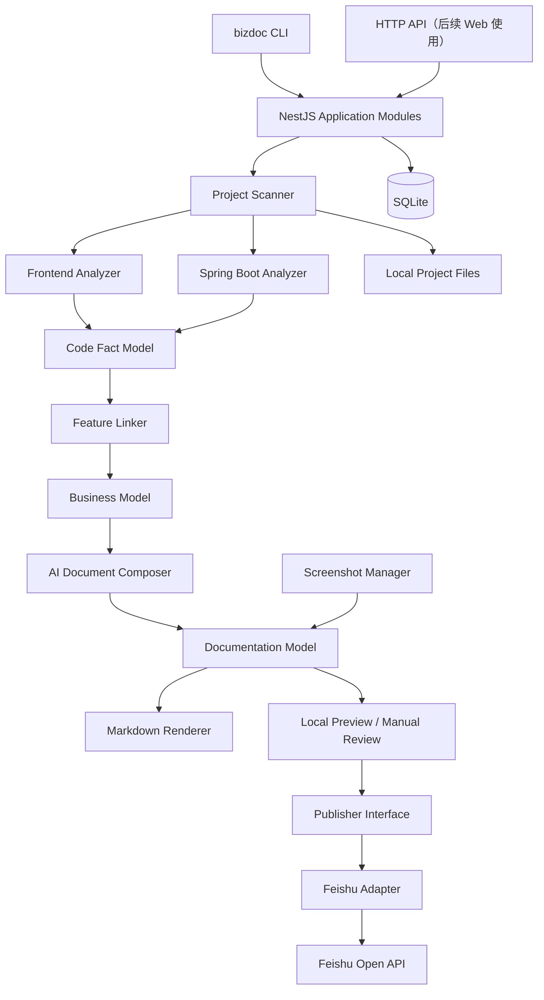
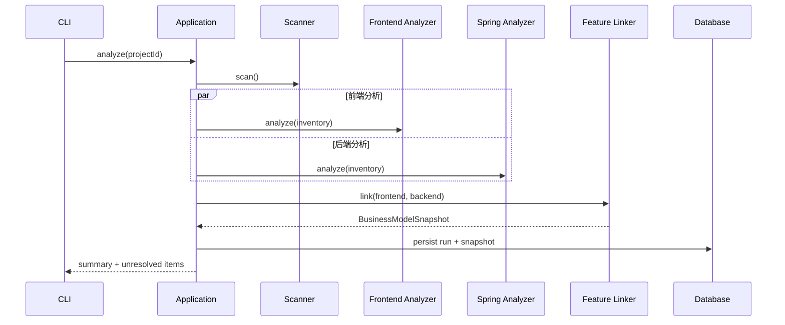

# AI Business Documentation Engine MVP 技术方案

> 文档状态：调研阶段技术基线  
> 需求基线：[MVP-PRD.md](./MVP-PRD.md)  
> 技术基线：Node.js Monorepo + NestJS  
> 版本：0.1  
> 更新日期：2026-08-18

## 1. 文档目的

本文档定义 MVP 的技术架构、模块职责、核心数据结构、关键接口、执行流程和验证方案，用于指导技术调研、原型验证和后续开发。

MVP 只验证以下闭环：

```text
Spring Boot + Vue/React 项目
  -> 代码事实解析
  -> 业务功能模型
  -> AI 生成业务操作文档
  -> 人工关联截图并审核
  -> 发布到飞书知识库
```

本方案不包含独立帮助中心、RAG、多 Agent、自动截图、Git 增量分析、多租户和复杂权限体系。

## 2. 设计原则

### 2.1 程序负责事实，AI 负责理解

- AST 和静态分析负责提取可验证的代码事实。
- AI 只基于结构化事实归纳业务语义和组织文档。
- AI 不得补全代码、配置和人工输入中不存在的业务规则。
- 每条重要结论保留来源、证据位置和可信度。

### 2.2 CLI 优先，后端能力复用

- MVP 的主要入口是 `bizdoc` CLI。
- NestJS 作为应用编排层和未来 Web/API 后端。
- CLI 通过 Nest Application Context 直接调用应用模块，不要求用户先启动常驻服务。
- 后续增加 Web 管理端时，可在相同应用模块之上增加 HTTP Controller。

### 2.3 模块化单体优先

MVP 使用单进程、单数据库的模块化单体，不拆微服务。解析、生成和发布之间通过稳定接口和持久化模型隔离，而不是通过网络隔离。

### 2.4 中间模型稳定

代码解析结果不能直接进入 Prompt，也不能直接生成 Markdown。核心链路包含三层模型：

1. `CodeFactModel`：解析器输出的代码事实。
2. `BusinessModel`：跨前后端归并后的业务功能模型。
3. `DocumentationModel`：与输出平台无关的文档结构。

Markdown 和飞书文档都由 `DocumentationModel` 派生。

## 3. 总体架构



### 3.1 部署形态

MVP 默认采用本地执行：

```text
研发人员电脑
├── 待分析的前后端项目（只读）
├── bizdoc CLI
├── NestJS Application Context
├── SQLite 数据库
├── 生成的 Markdown 与截图
└── 飞书 Open API 出站访问
```

此形态避免上传企业源码，也降低初期部署和权限成本。未来若改为集中式服务，需要重新设计源码接入、租户隔离、任务队列和凭证托管。

## 4. Monorepo 结构

使用 `pnpm workspace` 管理依赖，使用 Turborepo 管理构建、测试、类型检查和缓存。

```text
document-generation-engine/
├── apps/
│   ├── cli/                    # bizdoc 命令入口
│   └── server/                 # NestJS 启动入口及可选 HTTP API
├── packages/
│   ├── application/            # NestJS 业务编排模块
│   ├── project-scanner/        # 项目识别、文件清单、忽略规则
│   ├── analyzer-frontend/      # Vue/React/路由/页面/API 分析
│   ├── analyzer-spring/        # Spring Boot 静态分析
│   ├── feature-linker/         # 前后端事实关联与业务功能聚合
│   ├── business-model/         # 领域类型、Schema、校验规则
│   ├── ai-composer/            # Prompt、模型调用、结构化输出
│   ├── document-model/         # 平台无关的文档结构
│   ├── markdown-renderer/      # Markdown 生成与解析
│   ├── screenshot-manager/     # 截图导入、校验、关联
│   ├── publisher/              # 发布接口与发布编排
│   ├── publisher-feishu/       # 飞书适配器
│   ├── persistence/            # SQLite + Drizzle
│   ├── config/                 # 配置加载、Schema、密钥引用
│   └── observability/          # 日志、运行指标、错误规范
├── examples/
│   └── crm-demo/               # 可公开、可重复的试点项目
├── docs/
├── package.json
├── pnpm-workspace.yaml
└── turbo.json
```

约束：

- `apps/*` 只负责启动和协议适配，不承载核心业务逻辑。
- `packages/application` 负责用例编排，不解析 AST、不拼接飞书请求。
- 各分析模块只输出统一事实，不生成面向用户的自然语言文档。
- `business-model` 和 `document-model` 不依赖 NestJS、数据库或第三方 SDK。
- 禁止建立泛化的 `shared` 包；公共代码只有形成稳定职责后才独立成包。

## 5. 核心模块设计

### 5.1 Project Scanner

职责：识别项目类型、构建文件清单、应用忽略规则并记录代码基线。

```ts
interface ProjectScanner {
  scan(input: ScanProjectInput): Promise<ProjectInventory>;
}
```

输入包括项目根目录、可选前后端目录和忽略规则。输出包括技术栈、模块、源文件、配置文件和 Git Commit（若目录是 Git 仓库）。默认忽略 `.git`、`node_modules`、`target`、`dist`、构建产物、依赖源码和二进制文件。

安全约束：扫描器只读，不执行被分析项目中的脚本、构建命令或代码。

### 5.2 Frontend Analyzer

职责：解析 Vue/React 项目中的用户入口和操作事实。

MVP 提取：

- Vue Router、React Router、Umi 等显式路由配置；
- 菜单名称、页面和组件引用；
- 按钮、表单、字段、必填与显式校验；
- API 请求的方法、路径和调用位置；
- 页面跳转、显式权限表达式和成功/错误提示；
- 文案对应的源码位置。

推荐实现：

- TypeScript/JavaScript：`ts-morph`；
- Vue SFC：`@vue/compiler-sfc`，再将脚本交给 `ts-morph`；
- JSX/TSX：TypeScript AST；
- 模板：Vue Template AST 或 JSX AST；
- 框架识别使用适配器，统一输出 `FrontendFact[]`。

```ts
interface FrontendAnalyzer {
  analyze(project: ProjectInventory): Promise<FrontendAnalysis>;
}
```

第一版不追求计算运行时动态路由、动态字符串和所有封装层，只记录无法静态确认的关系并降低可信度。

### 5.3 Spring Boot Analyzer

职责：解析 Spring Boot 后端中的接口、调用关系和业务约束。

MVP 提取：

- `@RequestMapping` 及派生注解；
- Controller 方法、参数、返回类型和 Bean Validation；
- Service 方法及同项目内可解析的调用关系；
- Entity、DTO、枚举及主要字段；
- Repository/Mapper 的新增、修改、删除和查询意图；
- 显式条件、异常、权限注解和状态赋值；
- 事实对应的文件、行号和符号。

推荐使用 Tree-sitter Java，保持 Node.js 单运行时并避免强制安装 JVM。若调研证明复杂类型解析和符号解析不足，再评估 JavaParser Sidecar；该 Sidecar 不作为 MVP 默认依赖。

```ts
interface SpringAnalyzer {
  analyze(project: ProjectInventory): Promise<BackendAnalysis>;
}
```

### 5.4 Feature Linker

职责：把前端操作、API 和后端实现关联为候选业务功能。这是解析层最重要的深模块，调用者不需要理解各框架的关联细节。

关联优先级：

1. HTTP Method + 规范化 URL 完全匹配；
2. 请求字段、响应类型和源码调用位置辅助匹配；
3. 页面、按钮、方法和领域对象语义辅助归并；
4. 无法直接证明的关联标记为 `inferred`，不得标记为代码事实。

```ts
interface FeatureLinker {
  link(input: LinkFeaturesInput): Promise<BusinessModelSnapshot>;
}
```

`FeatureLinker` 产出候选功能、未关联前端操作、未关联后端接口以及冲突清单。人工可以在项目配置中添加显式映射，显式映射的优先级高于语义推断。

### 5.5 AI Document Composer

职责：基于 `BusinessFeature` 生成结构化 `DocumentationModel`，不直接写 Markdown。

```ts
interface DocumentComposer {
  compose(input: ComposeDocumentInput): Promise<ComposedDocument>;
}
```

实现要求：

- 使用支持 JSON Schema 的结构化输出；
- Prompt 只接收当前功能相关的最小事实集；
- 对输出执行 Schema 校验和证据引用校验；
- 输出必须区分事实、推断和未知；
- 字段值、角色、条件和结果没有证据时留空或形成审核项；
- 模型供应商通过配置选择，不让供应商类型渗入业务模型。

推荐使用 Vercel AI SDK 作为统一模型调用层，MVP 至少验证一个主要模型和一个备选模型。暂不引入 LangChain 或 Agent 工作流。

### 5.6 Screenshot Manager

职责：导入人工截图、保存元数据并关联文档步骤。

```ts
interface ScreenshotManager {
  import(input: ImportScreenshotInput): Promise<ScreenshotAsset>;
  attach(input: AttachScreenshotInput): Promise<DocumentRevision>;
}
```

MVP 支持 PNG、JPEG 和 WebP，导入时校验 MIME、尺寸、文件大小和内容哈希。资源复制到项目输出目录，Markdown 使用相对路径。截图通过 `featureId + documentSectionId` 关联，不依赖文件名猜测。

### 5.7 Publisher

发布模块提供小而稳定的接口，隐藏目录创建、文档 Block 转换、图片上传、限流重试和幂等更新。

```ts
interface Publisher {
  publish(input: PublishDocumentInput): Promise<PublishResult>;
}
```

MVP 只有两个适配器：

- `FeishuPublisher`：生产发布；
- `InMemoryPublisher`：自动化测试。

未来接入 GitBook 或独立 Help Center 时再新增适配器，不提前设计平台特有的通用字段。

## 6. 核心数据模型

所有模型使用 TypeScript 类型表达，并使用 Zod 或 JSON Schema 做运行时校验。标识符使用稳定、可读的字符串 ID，不使用数组位置作为身份。

### 6.1 代码证据

```ts
type EvidenceSource =
  | 'SOURCE_CODE'
  | 'SOURCE_CONFIG'
  | 'SOURCE_COMMENT'
  | 'AI_INFERENCE'
  | 'MANUAL_INPUT';

interface Evidence {
  id: string;
  source: EvidenceSource;
  repository?: string;
  commit?: string;
  file: string;
  symbol?: string;
  startLine?: number;
  endLine?: number;
  excerpt?: string;
}
```

### 6.2 业务功能

```ts
interface BusinessFeature {
  id: string;
  name: string;
  module: string;
  entry?: {
    route?: string;
    page?: string;
    action?: string;
  };
  roles: SupportedClaim<string>[];
  frontendRefs: CodeRef[];
  backendRefs: CodeRef[];
  apiRefs: ApiRef[];
  entities: EntityRef[];
  fields: BusinessField[];
  rules: BusinessRule[];
  outcomes: SupportedClaim<string>[];
  confidence: 'verified' | 'inferred' | 'conflicted';
  evidenceIds: string[];
}
```

`SupportedClaim<T>` 必须携带 `evidenceIds`。没有证据的 AI 内容只能标为 `inferred`，并进入人工审核项。

### 6.3 文档模型

```ts
interface DocumentationModel {
  id: string;
  featureId: string;
  title: string;
  summary?: DocContent;
  roles: DocContent[];
  scenarios: DocContent[];
  steps: OperationStep[];
  fields: FieldDescription[];
  outcomes: DocContent[];
  notices: DocContent[];
  faqs: FaqItem[];
  relatedFeatureIds: string[];
  reviewItems: ReviewItem[];
  revision: number;
}
```

截图是 `OperationStep` 或其他文档段落的资源引用。Markdown 和飞书 Block 都是渲染结果，不作为权威数据源。

## 7. 数据持久化

MVP 使用 SQLite + Drizzle ORM。数据库文件默认位于项目工作目录下的 `.bizdoc/bizdoc.db`，生成物位于 `.bizdoc/output/`。

核心表：

| 表 | 用途 |
|---|---|
| `projects` | 项目配置、源码路径和扫描设置 |
| `analysis_runs` | 每次分析的状态、Commit、时间和错误 |
| `code_facts` | 规范化代码事实及证据 |
| `business_snapshots` | 一次分析形成的业务模型快照 |
| `business_features` | 快照中的业务功能 |
| `documents` | 当前文档身份和审核状态 |
| `document_revisions` | 结构化文档版本及 Markdown 路径 |
| `assets` | 截图元数据、哈希和本地路径 |
| `publication_targets` | 飞书空间、父节点等目标配置 |
| `publications` | 本地文档与飞书节点/文档的映射及结果 |

重要约束：

- `analysis_runs`、业务快照和文档修订不可原地覆盖。
- 重新发布使用 `publications.remote_node_token` 更新已有文档，避免重复创建。
- 密钥不写入数据库和项目配置，只记录环境变量名称或系统密钥引用。
- 大段 AST 和源码不进入数据库，只保存必要事实、证据位置和短摘录。

## 8. 核心执行流程

### 8.1 初始化

```bash
bizdoc init
```

创建：

```text
.bizdoc/
├── project.yaml
├── assets/
└── output/
```

`project.yaml` 示例：

```yaml
version: 1
project:
  name: crm
sources:
  frontend:
    path: ./frontend
    framework: auto
  backend:
    path: ./backend
    framework: spring-boot
analysis:
  include:
    - src/**
  exclude:
    - "**/generated/**"
ai:
  provider: anthropic
  model: glm-5.3
  base_url: https://ai-service-api.msop.tech/v1
publishing:
  feishu:
    space_id: configured-space-id
    parent_node_token: configured-parent-node
```

配置中禁止出现 API Key、App Secret 等明文凭证。

### 8.2 分析

```bash
bizdoc analyze [project-path]
```



前后端解析可以并行，Feature Linker 必须等待两侧结果。任一侧失败时保留运行记录，不将不完整结果标记为成功快照。

### 8.3 文档生成与审核

```bash
bizdoc generate [--feature <feature-id>]
bizdoc screenshot add --feature <feature-id> --section <section-id> <file>
bizdoc preview
bizdoc review approve --document <document-id>
```

生成流程：选择业务功能、裁剪证据、调用模型、校验结构化输出、生成修订、渲染 Markdown。文档默认状态为 `draft`，存在冲突或无证据推断时为 `needs_review`。只有显式审核后的修订可发布。

`preview` 启动仅绑定 `127.0.0.1` 的临时本地预览服务，展示 Markdown、截图、证据和待审核项。MVP 不建设持久化 Web 管理端。

### 8.4 飞书发布

```bash
bizdoc publish feishu [--document <document-id>]
bizdoc generate --publish feishu
```

后一条命令仍必须遵守审核门槛：若生成了新修订或存在待审核项，则停止在发布前并返回明确提示，不能绕过人工审核。

发布步骤：

1. 验证文档修订已审核；
2. 获取 tenant access token；
3. 确保知识库目录节点存在；
4. 创建或定位对应飞书文档；
5. 上传截图并获得飞书资源标识；
6. 将 `DocumentationModel` 转换为飞书 Block；
7. 分批写入正文并维护顺序；
8. 保存本地与远端映射、版本和发布结果。

必须针对飞书开放平台做专项 Spike，验证：应用身份是否能访问目标知识空间、知识库节点与云文档的创建关系、图片上传流程、Block 类型覆盖、批量写入限制、限流和更新语义。

## 9. NestJS 应用设计

`apps/server` 采用 NestJS 模块化单体：

```text
AppModule
├── ConfigModule
├── PersistenceModule
├── ProjectModule
├── AnalysisModule
├── DocumentationModule
├── AssetModule
├── ReviewModule
└── PublicationModule
```

应用用例保持少量稳定接口：

```ts
interface AnalyzeProjectUseCase {
  execute(command: AnalyzeProjectCommand): Promise<AnalysisSummary>;
}

interface GenerateDocumentUseCase {
  execute(command: GenerateDocumentCommand): Promise<DocumentSummary>;
}

interface PublishDocumentUseCase {
  execute(command: PublishDocumentCommand): Promise<PublishSummary>;
}
```

CLI 和 HTTP Controller 都只调用这些用例。NestJS 装饰器和 DTO 只存在于启动与传输层，核心模型不依赖框架。

MVP 任务在当前进程内执行，并将阶段和结果写入 `analysis_runs`。暂不引入 Redis/BullMQ；只有出现常驻服务、并发用户、任务恢复或分布式执行需求后才增加队列。

## 10. 错误处理与可观测性

统一错误分类：

- `CONFIG_ERROR`：项目配置或凭证引用错误；
- `SCAN_ERROR`：目录不可读、项目无法识别；
- `PARSE_ERROR`：语法或框架解析失败；
- `MODEL_ERROR`：模型超时、限流或结构化输出无效；
- `REVIEW_REQUIRED`：发布前仍需人工审核；
- `PUBLISH_ERROR`：飞书授权、限流、内容或网络错误。

CLI 默认输出阶段、进度、摘要和可操作的错误信息；`--verbose` 输出详细日志。日志采用结构化 JSON 写入 `.bizdoc/logs/`，默认对 Token、Secret、Authorization Header 和源码片段脱敏。

每次运行至少记录：运行 ID、项目 ID、Commit、耗时、文件数、事实数、候选功能数、未关联数、模型及 Token 用量、文档修订和发布结果。

## 11. 安全与合规

- 默认本地处理源码，未经明确配置不上传完整文件。
- 发送给模型的内容限定为当前功能相关事实和最小必要源码摘录。
- 支持配置不允许发送到外部模型的目录和文件模式。
- 分析过程不执行项目脚本，不加载项目运行时配置，不连接业务数据库。
- 飞书和模型凭证由环境变量或操作系统安全存储提供。
- 日志、数据库和生成物不得包含密钥、客户数据或连接字符串。
- 发布前必须展示目标知识空间、父目录和文档数量，避免误发。

涉及企业私有源码时，模型供应商、数据保留政策和跨境要求必须在试点前由企业确认。

## 12. 测试策略

测试以模块接口为主要测试面，不依赖内部 AST 实现细节。

### 12.1 Fixture 项目

建立可提交到仓库的最小 CRM Fixture，包含：

- React 和 Vue 各一个代表性页面；
- Spring Boot Controller、Service、DTO、Entity 和 Repository；
- 创建、编辑、状态变更和权限控制等典型行为；
- 可确认、不可确认和前后端冲突三类场景。

### 12.2 测试层级

| 层级 | 重点 |
|---|---|
| 模型测试 | Schema、ID、证据约束、修订不可变性 |
| 分析模块契约测试 | Fixture 输入到规范化事实输出 |
| Feature Linker 测试 | API 匹配、显式映射、冲突与未关联项 |
| AI 评测 | 事实一致性、幻觉率、结构完整性、人工修改率 |
| 渲染快照测试 | Documentation Model 到 Markdown/飞书 Block |
| 飞书适配器测试 | Mock 契约测试和测试知识空间集成测试 |
| CLI 端到端测试 | init -> analyze -> generate -> screenshot -> approve -> publish |

AI 输出不使用单纯文本快照判断质量。调研阶段建立 3 至 5 个真实业务功能的人工金标，重点衡量：事实准确率、步骤覆盖率、无证据陈述数、人工修改时间和成功发布率。

## 13. 技术选型

| 领域 | 推荐选型 | 说明 |
|---|---|---|
| Runtime | Node.js 当前 LTS + TypeScript | 团队统一运行时 |
| Monorepo | pnpm workspace + Turborepo | 依赖管理和任务缓存 |
| 后端 | NestJS | 模块化单体、依赖注入、未来 HTTP 能力 |
| CLI | Commander.js | 小而稳定，直接调用 Nest Application Context |
| 配置校验 | Zod | 配置和模型运行时校验 |
| Java 解析 | Tree-sitter Java | Node 单运行时，适合静态事实提取 |
| TS/JS 解析 | ts-morph | 类型和符号导航能力 |
| Vue 解析 | @vue/compiler-sfc | 正确拆分 SFC 与模板 AST |
| AI | Vercel AI SDK | 结构化输出和供应商适配 |
| Markdown | unified + remark | AST 转换，避免字符串拼接 |
| 数据库 | SQLite + Drizzle ORM | 本地、轻量、可迁移 |
| 飞书 | @larksuiteoapi/node-sdk | 官方 Node SDK |
| 日志 | pino | 结构化日志与脱敏 |
| 测试 | Vitest | TypeScript 与 Monorepo 友好 |

具体依赖版本在启动开发时锁定，并以当时仍受维护的稳定版本为准。

## 14. 调研阶段 Spike

开发启动前完成四个可丢弃的技术 Spike：

### Spike A：跨栈代码关联

选取一个真实功能，验证从页面按钮、表单、请求封装到 Spring Controller、Service 和 Entity 的完整关联。输出成功关联、需人工配置和无法静态分析的节点。

通过标准：主要路径可由证据还原，且不存在依赖执行业务系统才能获得的关键事实。

### Spike B：业务文档质量

以人工整理的 `BusinessFeature` 为输入生成 Markdown，由研发和业务人员共同评分。

通过标准：无事实性幻觉，主体步骤可用，人工修改时间明显低于从零撰写。

### Spike C：截图工作流

验证截图导入、步骤关联、本地预览、Markdown 相对路径和飞书图片显示。

通过标准：同一结构化文档可稳定渲染到本地和飞书，图片位置符合预期。

### Spike D：飞书发布

在测试知识空间验证创建目录、创建文档、写入标题/列表/表格/图片、更新已有文档和限流重试。

通过标准：应用权限可控，重复发布不产生重复文档，失败后可定位和重试。

## 15. 实施阶段建议

实施工作已进一步拆分为五个可独立执行和验收的 Codex Goal：

1. [Goal 1：建立工程基座](./goals/GOAL-01-FOUNDATION.md)
2. [Goal 2：完成代码解析闭环](./goals/GOAL-02-CODE-ANALYSIS.md)
3. [Goal 3：完成文档生成、截图与审核闭环](./goals/GOAL-03-DOCUMENT-GENERATION.md)
4. [Goal 4：完成飞书发布闭环](./goals/GOAL-04-FEISHU-PUBLISHING.md)
5. [Goal 5：完成真实项目端到端验收](./goals/GOAL-05-PILOT-VALIDATION.md)

每个 Goal 均明确描述结果、约束条件和确认标准。应按顺序执行，并在前一 Goal 的确认标准全部通过后再进入下一 Goal。

### 阶段 0：调研与决策

- 完成四个 Spike；
- 确认真实试点项目和 3 至 5 个业务功能；
- 确认模型和源码合规要求；
- 固化 Business Model 与 Documentation Model Schema。

### 阶段 1：解析闭环

- 初始化 Monorepo、CLI 和 NestJS 应用；
- 完成扫描器、前后端分析器和 Feature Linker；
- 输出可人工审查的业务模型 JSON。

### 阶段 2：文档闭环

- 完成 AI Composer、文档模型和 Markdown Renderer；
- 完成截图导入、本地预览和审核状态；
- 对金标样例进行质量评测。

### 阶段 3：发布闭环

- 完成飞书适配器和幂等映射；
- 跑通测试知识空间；
- 对一个真实业务功能完成端到端验收。

## 16. 风险与应对

| 风险 | 影响 | MVP 应对 |
|---|---|---|
| 前端请求封装和动态路由差异大 | 页面到 API 关联不完整 | 框架适配器 + 显式映射配置 + 未关联报告 |
| Java Tree-sitter 缺少完整类型解析 | Service 调用链不完整 | 先验证关键路径，必要时增加 JavaParser Sidecar |
| 静态代码无法证明实际操作顺序 | 文档步骤错误 | 只输出有证据步骤，标记推断并人工审核 |
| AI 生成无证据业务规则 | 文档失真 | 最小事实输入、结构化输出、证据校验和发布门槛 |
| 飞书 Markdown 支持不等同标准 Markdown | 排版或图片丢失 | 从 Documentation Model 直接生成飞书 Block |
| 飞书权限和限流复杂 | 发布失败 | 先做专项 Spike，保存远端映射并支持重试 |
| 企业源码发送到外部模型 | 合规风险 | 本地解析、最小摘录、可配置模型和供应商审批 |
| MVP 架构过度扩张 | 延迟价值验证 | 模块化单体、进程内任务、无 Web、无队列、无 RAG |

## 17. 关键架构决策

1. **采用 Node.js Monorepo 和 NestJS 模块化单体。** 原因是共享 TypeScript 模型、降低部署复杂度，并为未来 Web/API 留出入口。
2. **CLI 直接启动 Nest Application Context。** MVP 无需常驻后端，同时复用相同用例模块。
3. **使用三层中间模型。** 解析事实、业务语义和文档结构分别演进，避免 Markdown 或飞书格式反向污染解析逻辑。
4. **Markdown 不是唯一权威模型。** 权威内容是 Documentation Model，Markdown 与飞书 Block 是不同渲染结果。
5. **发布必须经过人工审核。** `generate --publish` 不能跳过新修订的审核门槛。
6. **MVP 使用 SQLite，不引入 Redis 和消息队列。** 等并发、恢复和集中式部署需求真实出现后再升级。
7. **默认不执行被分析项目。** 只做静态、只读分析，降低安全和环境依赖。

## 18. MVP 完成定义

在一个真实 Spring Boot + Vue/React 项目中，至少选择一个业务功能，并满足：

- 能从页面入口追踪到 API、Controller、Service 和主要业务对象；
- 每个关键结论可定位到代码、配置、注释或人工输入；
- 能生成结构化文档和可阅读的 Markdown；
- 能人工关联至少一张截图并正确预览；
- 审核后的文档能够创建或幂等更新到飞书知识库；
- 全流程可通过 CLI 重复执行；
- 失败不会覆盖已审核文档或产生不可识别的远端重复内容。

只有这条闭环在真实项目上可重复运行，MVP 技术路线才视为成立。
