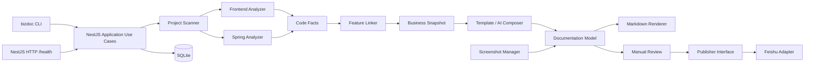

# 当前系统架构

本文描述 `v0.1.0` 代码的实际结构。MVP 开发前的设计基线保存在[历史技术方案](../milestones/v0.1-mvp/TECHNICAL-DESIGN.md)。

## 总体结构

## 运行入口

- `apps/cli` 是完整工作流入口，通过 Nest Application Context 调用应用用例，不要求先启动常驻服务。
- `apps/server` 是未来 Web/API 的 NestJS 入口，当前仅提供健康检查。
- `packages/application` 编排分析、生成、审核、截图和发布用例，不承载解析器或平台适配细节。

## 模块边界

| 模块 | 当前职责 |
|---|---|
| `project-scanner` | 校验源码根目录、按 include/exclude 构建文件清单并读取 Git Commit |
| `analyzer-frontend` / `analyzer-spring` | 从前后端代码提取结构化、可追溯事实 |
| `business-model` | 定义 Evidence、CodeFact、BusinessFeature、Snapshot 及统一脱敏 |
| `feature-linker` | 关联页面操作、API 和后端方法，形成业务功能候选 |
| `ai-composer` | 使用证据模板或模型生成 DocumentationModel，并执行证据约束 |
| `document-model` | 定义与 Markdown、飞书无关的权威文档结构 |
| `screenshot-manager` | 校验、去重和持久化截图资源 |
| `markdown-renderer` | 从 DocumentationModel 生成本地预览 Markdown |
| `publisher` / `publisher-feishu` | 定义发布契约并实现飞书 Block、图片、重试和幂等更新 |
| `persistence` | 使用 SQLite 保存不可变快照、修订、审核与发布审计 |
| `config` / `observability` | 配置校验、环境变量边界、日志和错误脱敏 |

## 关键约束

- `CodeFact -> BusinessModelSnapshot -> DocumentationModel` 是稳定的数据边界，渲染器和发布适配器不得反向解析 Markdown 作为权威数据。
- 分析运行、业务快照和文档修订不可变；审核解决记录独立保存。
- 外部模型和飞书依赖位于适配器边界，核心模型不依赖供应商 SDK。
- 发布前完成审核与本地资源预检；更新远端时先写入完整新内容，再删除旧内容。
