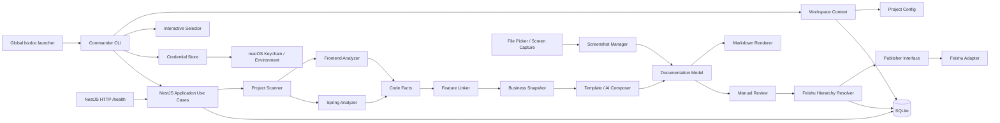

# 当前系统架构

本文描述 `v0.1.1` 当前代码的实际结构。MVP 开发前的设计基线保存在[历史技术方案](../milestones/v0.1-mvp/TECHNICAL-DESIGN.md)。

## 总体结构

## 运行入口

- `bin/bizdoc.mjs` 是本地全局命令启动器，通过 `tsx` 加载仓库中的 TypeScript 源码；它服务于开发调试，不是 npm 发布产物。
- `apps/cli` 使用 Commander 提供完整工作流，通过 Nest Application Context 调用应用用例，不要求先启动常驻服务。
- Workspace Context 从显式目录或当前目录向上定位 `.bizdoc/project.yaml`；显式目录保持严格校验，避免脚本误操作其他工作空间。
- CLI Selector 在交互终端按名称选择功能、文档和步骤；非交互调用必须提供足以消除歧义的 ID，并可用 JSON 输出衔接自动化。
- Credential Store 以环境变量优先，其次读取 macOS Keychain；写入通过 `security -i` 的标准输入完成，真实值不进入子进程参数、项目配置、SQLite 或命令输出。
- `apps/server` 是未来 Web/API 的 NestJS 入口，当前仅提供健康检查。
- `packages/application` 编排分析、生成、旧文档分类迁移、审核、截图和发布用例，不承载解析器或平台适配细节。

## 模块边界

| 模块 | 当前职责 |
|---|---|
| `project-scanner` | 校验源码根目录、按 include/exclude 构建文件清单并读取 Git Commit |
| `analyzer-frontend` / `analyzer-spring` | 从前后端代码提取结构化、可追溯事实 |
| `business-model` | 定义 Evidence、CodeFact、BusinessFeature、Snapshot 及统一脱敏 |
| `feature-linker` | 关联页面操作、API 和后端方法，形成业务功能候选 |
| `ai-composer` | 使用证据模板或模型生成 DocumentationModel，并执行证据约束 |
| `document-model` | 定义与 Markdown、飞书无关的权威文档结构，包括稳定的系统/业务模块分类 |
| `screenshot-manager` | 校验、去重和持久化截图资源 |
| `markdown-renderer` | 从 DocumentationModel 生成本地预览 Markdown |
| `publisher` / `publisher-feishu` | 定义发布契约，实现飞书系统/模块层级解析、Block、图片、节点移动、重试和幂等更新 |
| `persistence` | 使用 SQLite 保存不可变快照、修订、审核、发布审计及系统/模块/文档远端节点映射 |
| `config` / `observability` | 配置与工作空间校验、环境变量/钥匙串边界、日志和错误脱敏 |

## 关键约束

- `CodeFact -> BusinessModelSnapshot -> DocumentationModel` 是稳定的数据边界，渲染器和发布适配器不得反向解析 Markdown 作为权威数据。
- 分析运行、业务快照和文档修订不可变；审核解决记录独立保存。
- 外部模型和飞书依赖位于适配器边界，核心模型不依赖供应商 SDK。
- 新生成文档必须携带稳定系统 ID 和经确认的业务模块 ID；旧修订为兼容读取允许缺少分类，空白或名称为“未分类”的模块同样视为无有效分类，发布入口在飞书凭证和网络边界前拒绝这些文档。
- 旧文档分类迁移在应用层预检全部截图引用后创建不可变的新修订，保留原正文、来源元数据和截图引用并增加 blocking 分类审核项；旧批准状态和审核解决记录不会跨修订继承。
- `publication_node_mappings` 以发布目标和本地稳定节点 ID 复用系统、模块与文档；已有文档改变父级时移动原节点，不按标题重建。
- 没有映射的系统或模块先分页查找同父级唯一节点再创建；重名歧义会阻塞，业务文档不会仅凭标题接管人工页面。
- 非幂等创建请求和按索引批量删除不自动重试；发布前完成审核与本地资源预检，更新远端时先写入完整新内容，再删除旧内容。
